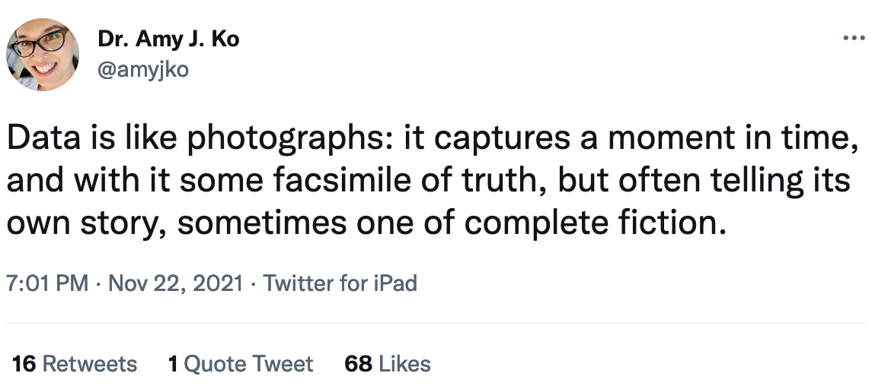
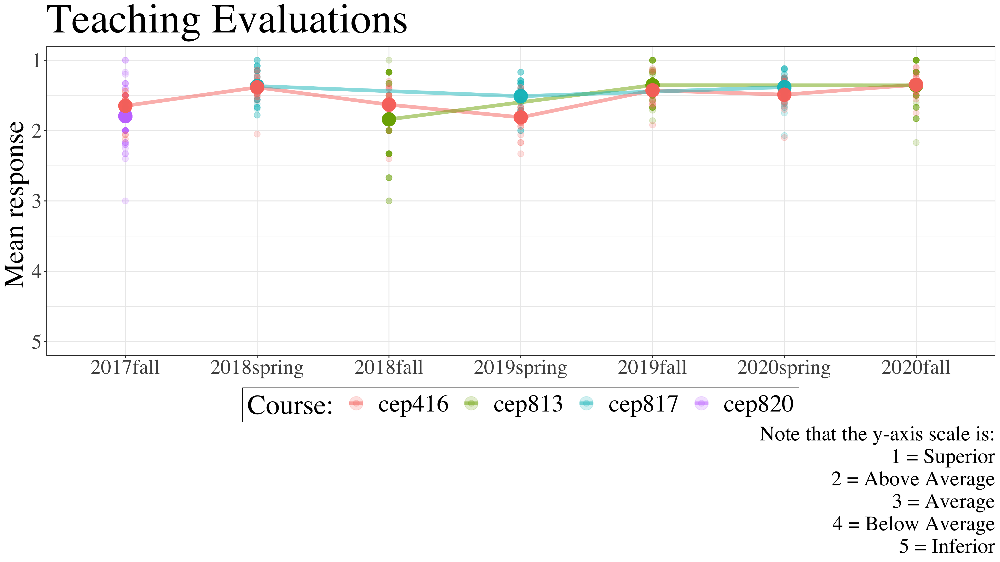
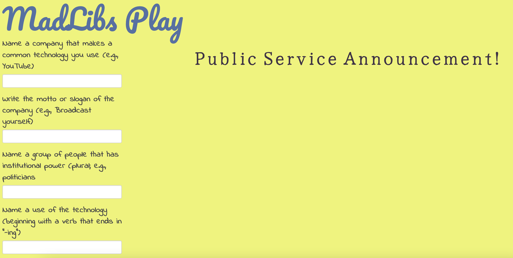

```{r setup, include=FALSE}
usethis::use_git_ignore(c("*.csv", "*.rds"))
options(htmltools.dir.version = FALSE)

library(knitr)
library(tidyverse)
library(xaringan)
library(fontawesome)
```

class: inverse, center, middle

# `r fa("far fa-images", fill = "#fff")`

**View the slides:** 

[bretsw.github.io/eme6356-module9](https://bretsw.github.io/eme6356-module9)

---

# Data Stories

```{r, out.width = "100%", echo = FALSE, fig.align = "center"}

```

>Data is like photographs: it captures a moment in time, and with it some facsimile of truth, but often telling its own story, sometimes one of complete fiction.

(Tweet from [@amyjko](https://twitter.com/amyjko/status/1462934403227668485))

---

# Data Stories

```{r, out.width = "600px", echo = FALSE, fig.align = "center"}

```

*AI Education for Teens: Lifting the Hood on Data and Machine Learning*

(Tweet from [@shuchig](https://twitter.com/shuchig/status/1463194783283884043))

---

class: inverse, center, middle

# `r fa("far fa-comments", fill = "#fff")` <br> Module 8 Discussion

---

# Sharing Kudos

```{r, out.width = "540px", echo = FALSE, fig.align = "center"}
include_graphics("img/applause.jpg")
```

--

For phenomenal case discussion:

--

- `r fa("thumbs-up", fill = "#782F40")` Group B (12 threads + 63 comments)

--

- `r fa("thumbs-up", fill = "#782F40")` Group D (12 threads + 55 comments)

---

# Sharing Kudos

```{r, out.width = "540px", echo = FALSE, fig.align = "center"}
include_graphics("img/applause.jpg")
```

For going above-and-beyond as a facilitator:

--

- `r fa("thumbs-up", fill = "#782F40")` Tiffany (10 response in Case B)

--

- `r fa("thumbs-up", fill = "#782F40")` Mark (9 response in Case D)

---

class: inverse, center, middle

# `r fa("fas fa-cog", fill = "#fff")` <br> Case A: <br> **Game-Based Learning** <br> **with Kinect**

---

# Assumptions about Learning

```{r, out.width = "600px", echo = FALSE, fig.align = "center"}
include_graphics("img/grocery-list.jpg")
```

--

- Methods answer only questions about learning vocabulary words from a grocery list

---

# Evidence for Conclusions

```{r, out.width = "600px", echo = FALSE, fig.align = "center"}

```

--

- Can't speak to motivations or answer "Why?"

--

- Significance vs. statistical significance: mean of 69% vs 76%

---

# Challenges in Deployment

```{r, out.width = "600px", echo = FALSE, fig.align = "center"}

```

--

- Development time, support needed, rapid innovation

--

- Need to view as a system

---

class: inverse, center, middle

# `r fa("fas fa-cog", fill = "#fff")` <br> Case B: <br> **Text Analysis** <br> **with LIWC**

---

# Validity Issues

```{r, out.width = "600px", echo = FALSE, fig.align = "center"}
include_graphics("img/disguise.jpg")
```

--

- Bias in measuring `tone`, `clout`, `positivity`, etc.

--

- (e.g., does "bad" mean bad or does "bad" mean awesome?)

---

# Best to Prompt Questions

```{r, out.width = "600px", echo = FALSE, fig.align = "center"}
include_graphics("img/question.jpg")
```

--

- How does `tone` change over time? vs. Is the `tone` appropriate?

---

# Move toward Supervision

```{r, out.width = "580px", echo = FALSE, fig.align = "center"}

```

--

- LIWC was a **supervised** machine learning classifier trained on specific contextual data

--

- But is **unsupervised** if you just apply the classifier to your dataset

---

# Move toward Supervision

```{r, out.width = "580px", echo = FALSE, fig.align = "center"}

```

- To alleviate biases in transferring to your own context, might be better to train your own **supervised** ML classifier

---

class: inverse, center, middle

# `r fa("fas fa-cog", fill = "#fff")` <br> Case C: <br> **Learning Analytics** <br> **in Higher Ed Libraries**

---

# Data Accessible to Students

```{r, out.width = "720px", echo = FALSE, fig.align = "center"}
include_graphics("img/open.jpg")
```

--

- Who has access? Who gives feedback? Who benefits?

---

# Professor Evaluations

--

```{r, out.width = "100%", echo = FALSE, fig.align = "center"}

```

---

# Questions `r fa("fas fa-arrow-right", fill = "#fff")` Data

```{r, out.width = "720px", echo = FALSE, fig.align = "center"}
include_graphics("img/traffic.jpg")
```

--

Looking at aggregate or individual?

---

class: inverse, center, middle

# `r fa("fas fa-cog", fill = "#fff")` <br> Case D: <br> **AI-Based Learning** <br> **with Knewton Alta**

---

# Lessons from Dystopia

```{r, out.width = "720px", echo = FALSE, fig.align = "center"}

```

--

Imagine the worst possible way a tool could be used:

--

[**Get creative with a MadLib**](https://bretsw.shinyapps.io/madlibs-play/)

---

# Robots Replacing Teachers?

```{r, out.width = "720px", echo = FALSE, fig.align = "center"}
include_graphics("img/robot.jpg")
```

---

# AI Giving an Extra Nudge

```{r, out.width = "720px", echo = FALSE, fig.align = "center"}
include_graphics("img/bike-machine.jpg")
```

---

class: inverse, center, middle

# `r fa("fas fa-binoculars", fill = "#fff")` <br> Looking Ahead

---

# Future of Analytics

```{r, out.width = "720px", echo = FALSE, fig.align = "center"}

```

---

# Course Feedback

```{r, out.width = "600px", echo = FALSE, fig.align = "center"}
include_graphics("img/tools.jpg")
```

--

- What are your major takeaways from this course?

--

- What course elements have been the most impactful?

--

- Do you have any suggestions for future iterations of this course?

---

# Course Feedback

<div class="padlet-embed" style="border:1px solid rgba(0,0,0,0.1);border-radius:2px;box-sizing:border-box;overflow:hidden;position:relative;width:100%;background:#F4F4F4"><p style="padding:0;margin:0"><iframe src="https://fsu.padlet.org/embed/1l5i0qo19s7i0pc3" frameborder="0" allow="camera;microphone;geolocation" style="width:100%;height:480px;display:block;padding:0;margin:0"></iframe></p><div style="padding:8px;text-align:right;margin:0;"><a href="https://padlet.com?ref=embed" style="padding:0;margin:0;border:none;display:block;line-height:1;height:16px" target="_blank"></a></div></div>

---

# Analytics Problem Plan

```{r, out.width = "520px", echo = FALSE, fig.align = "center"}
include_graphics("img/planning.jpg")
```

--

- Should feel similar to the three Analytics Practice Assignments you completed

--

- But not doing any analysis this time, just going into more detail for the plan

--

### Due Friday, Dec 10

---

class: inverse, center, middle

# Questions?

```{r, out.width = "480px", echo = FALSE, fig.align = "center"}
include_graphics("img/question.jpg")
```

**What questions can I answer for you now?**

**How can I support you this week?**

<hr>

`r fa("envelope", fill = "white")` [bret.staudtwillet@fsu.edu](mailto:bret.staudtwillet@fsu.edu) | `r fa("twitter", fill = "white")` [@bretsw](https://twitter.com/bretsw) | `r fa("globe", fill = "white")` [bretsw.com](http://bretsw.com)